# System Management Tasks

---

## Estimated Time

01:00

### Overview

This exercise examines various system management tasks that an administrator might perform.
You will configure software repositories, and use some standard Linux tools.

### Objectives

At the end of this exercise, you should be able to:

- Verify network configuration
- Create a YUM software repository
- Configure VNC service on a Linux server

### Introduction

When you installed Linux in the previous exercise, you used virtual optical media. This exercise provides you an opportunity to configure additional tools on your operating system. You will also use Linux management tools, from both the CLI as well as GUI.

### Requirements

- This workbook
- A workstation with VNC viewer software connected to a network
- IBM Power server with Linux installed
  - VIOS with configured virtual media resources

## 1. RHEL system management

---

### Preface

> **Note:** Any exercise step that asks for a value from a command output may use an example generated during lab testing. Your results may vary.
> **Important:** You may be sharing the VIOS environment with other learners. Please follow these steps closely so you do not impact other learners.

## Section 1. Network operations

---

1. Log in to your Red Hat Enterprise Linux virtual machine as you did in the previous exercise.
2. Use the traditional command `ifconfig` to show your current IP address. The command `ifconfig` is part of the **nettools** package, and while deprecated, is still available with RHEL v8.

   ```bash
   # ifconfig -a
   env32: flags=4163<UP,BROADCAST,RUNNING,MULTICAST> mtu 1500
   . . .
   ```

3. Use the `ip` command to show the same information. Use the `ip` command as in the following example:

   ```bash
   # ip addr show

   1 1: lo: <LOOPBACK,UP,LOWER_UP> mtu 65536 qdisc noqueue state UNKNOWN group
   default qlen 1000
   link/loopback 00:00:00:00:00:00 brd 00:00:00:00:00:00
   inet 127.0.0.1/8 scope host lo
   valid_lft forever preferred_lft forever
   inet6 ::1/128 scope host
   valid_lft forever preferred_lft forever
   2: env32: <BROADCAST,MULTICAST,UP,LOWER_UP> mtu 1500 qdisc fq_codel state
   UNKNOWN group default qlen 1000
   link/ether fa:56:99:5b:f3:20 brd ff:ff:ff:ff:ff:ff
   inet 10.8.x.xxx/24 brd 10.8.x.255 scope global noprefixroute env32
   valid_lft forever preferred_lft forever
   inet6 fe80::f856:99ff:fe5b:f320/64 scope link
   valid_lft forever preferred_lft forever
   ```

4. There is a configuration file used at system initialization for network services. Find and view this file.

   - The file is _/etc/sysconfig/network-scripts/ifcfg-env32_. Your results will be different from this example:

     ```bash
     # cat ifcfg-env32
     [root@rhel81-ibm-yourname network-scripts]# cat ifcfg-env32

     # Generated by dracut initrd
     NAME="env32"
     HWADDR="fa:56:99:5b:f3:20"
     DEVICE="env32"
     ONBOOT=yes
     NETBOOT=yes
     UUID="630aeeeb-ff12-4224-b57b-4eef4288d874"
     BOOTPROTO=none
     IPADDR="10.8.x.xxx"
     NETMASK="255.255.255.0"
     GATEWAY="10.8.x.254"
     TYPE=Ethernet
     ```

5. Run the commands `arp` and `ip neigh`. Each should show “Neighbor” systems.

   - This is an example of the new `ip` command and the command it is replacing.

   ```bash
   # arp
   Address     HWtype   HWaddress           Flags   Mask
   Iface
   _gateway    ether    00:00:5e:00:01:05   C
   env32
   10.8.6.252  ether    c4:f7:d5:2c:71:27   C
   env32
   ```

   ```bash
   # ip neigh
   10.8.6.254 dev env32 lladdr 00:00:5e:00:01:05 REACHABLE
   10.8.6.252 dev env32 lladdr c4:f7:d5:2c:71:27 STALE
   ```

6. Run the commands `route` and `ip route`. Each should show routing information to other network systems.

   - This is an example of the new ip command and the command it is replacing.

   ```bash
   # route
   Kernel IP routing table
   Destination     Gateway     Genmask        Flags       Metric      Ref     Use     Iface
   default         _gateway    0.0.0.0        UG          100         0       0       env32
   10.8.6.0        0.0.0.0     255.255.255.0  U           100         0       0       env32
   ```

   ```bash
   # ip route
   default via 10.8.6.254 dev env32 proto static metric 100
   10.8.6.0/24 dev env32 proto kernel scope link src 10.8.6.102 metric 100
   ```

## Section 2. Software repository management

---

7. As the root user, issue the command `yum repolist`. What happens?
   - You may see error messages. No software repository is configured by default. As an administrator, it’s your job to create one on your system.

> Note: The following steps provide an example of creating a yum repository, and are not intended to show the only method you can use.

8. Let’s create a new repository file so Yum knows where to look for, when it needs to install new packages.

   - A new file needs to be created. In this case, let’s call it **rhel81.repo**. This file needs to be edited to provide mapping information to the actual repository. We have already extracted the right repository packages from the installation media and saved it on our NFS server. So, you’ll simply reference that in your configuration file.

   ```bash
   # vi /etc/yum.repos.d/rhel81.repo
   ```

   - Add the following content to this file:

   ```bash
   [rhel81-baseos]
   name=RHEL 8.1 BaseOS
   baseurl=http://10.8.252.1/repos/os/redhat/tree/rhel-8.1-ppc64le/BaseOS
   enabled=1
   gpgcheck=0

   [rhel81-appstream]
   name=RHEL 8.1 AppStream
   baseurl=http://10.8.252.1/repos/os/redhat/tree/rhel-8.1-ppc64le/AppStream
   enabled=1
   gpgcheck=0
   ```

9. At this point, you should have a software repository available to the `yum` command. List all repositories known to your system.

   - Use the argument `repolist` to find this information.

   ```bash
   # yum repolist
   Updating Subscription Management repositories.
   Unable to read consumer identity
   This system is not registered to Red Hat Subscription Management. You can use subscription-manager to register.
   RHEL 8.1 BaseOS                         19 MB/s | 1.9 MB    00:00
   RHEL 8.1 AppStream                      34 MB/s | 4.8 MB    00:00
   repo id                         repo name
   status
   rhel81-appstream                RHEL 8.1 AppStream
   3,765
   rhel81-baseos                   RHEL 8.1 BaseOS
   1,250
   ```

> Note: The example above has text that includes the comment This system is not registered to Red Hat Subscription Management. You are installing Red Hat in a classroom environment, so registering the system with Red Hat is not required to create a Yum repository.

10. List contents of yum repositories on your system. This may be a very long list. So, let’s filter the output with, say ‘python’.

    - Use the yum as in the following example:

    ```bash
    # yum list | grep python
    libpeas-loader-python3.ppc64le                                  1.22.0-6.el8
    @AppStream
    platform-python.ppc64le                                         3.6.8-15.1.el8
    @anaconda
    platform-python-coverage.ppc64le                                4.5.1-7.el8
    @AppStream
    platform-python-pip.noarch                                      9.0.3-15.el8
    …
    ```

> Note: When viewing the output of the `yum list` command, you can see software that is installed or just available on the repository. If the repository name has the “@” in front, that package is currently installed.

11. The command line is good, but what if someone comes to you with a request to install a graphical user interface?

    - The command `yum groupinstall “Server with GUI”` will help you achieve that. If you add the argument `-y`, you will not have to confirm the installation. This should be pretty quick because we already installed the ‘Server with GUI’ option. This was the default mode of installation with RHEL 8+.

    ```bash
    # yum groupinstall -y "Server with GUI"
    ```

12. Install the following packages on your system:

    - tigervnc-server.ppc64le
    - xterm.ppc64le
    - libX11-devel.ppc64le

- Use the yum command for each package, as in the following example (repeat for all packages):

  ```bash
  # yum install -y tigervnc-server.ppc64le
  ```

  ```bash
  # yum install -y xterm.ppc64le
  ```

  ```bash
  # yum install -y libX11-devel.ppc64le
  ```

## Section 3. Activate the VNC server

---

13. First, let’s switch to the ‘student’ user we created before, and run the ‘vncpasswd’ command. Enter the password as **Passw0rd$$**.

    ```bash
    su - student
    vncpasswd

    [root@rhel81-ibm-yourname system]# su - student
    [student@rhel81-ibm-yourname ~]$ vncpasswd
    Password:
    Verify:
    Would you like to enter a view-only password (y/n)? n
    A view-only password is not used
    [student@rhel81-ibm-yourname ~]$
    ```

14. Now, go back to being root again. Enter the password when prompted.

    ```bash
    su -
    ```

15. Let’s create a new configuration file for this VNC Server.

    ```bash
    nano /etc/systemd/system/vncserver@.service
    ```

16. Copy and paste the following text in it.

    ```bash
    [Unit]
    Description=Remote desktop service (VNC)
    After=syslog.target network.target

    [Service]
    Type=forking
    WorkingDirectory=/home/student
    User=student
    Group=student

    PIDFile=/home/student/.vnc/%H%i.pid

    ExecStartPre=/bin/sh -c '/usr/bin/vncserver -kill %i > /dev/null
    2>&1 || :'
    ExecStart=/usr/bin/vncserver -autokill %i
    ExecStop=/usr/bin/vncserver -kill %i

    [Install]
    WantedBy=multi-user.target
    ```

> Note: VNC will use TCP port 5900+N, where N is the display number. If the display number is 1, VNC server will run on display port number 5901. This means that 5901 would be the port you will use to connect to your system.

17. With default security set, you will need to set firewall rules to allow for inbound traffic.

    - Use the following example to enable vnc traffic through the firewall.

    ```bash
    # firewall-cmd --permanent --zone=public --add-service vnc-server
    success
    ```

    ```bash
    # firewall-cmd --reload
    success
    ```

18. To activate a VNC server, you will not use the root user. For this reason you created the user student during the installation. Access the student user, and start VNC server (with a password of Passw0rd$$).

    - Use the `su` command to change your status to the user student, and issue the `vncserver` command.

    ```bash
    # su - student
    $ vncserver
    xauth:  file /home/student/.Xauthority does not exist
    New 'rhel81-ibm-yourname:1 (student)' desktop is rhel81-ibm-yourname:1

    Creating    default startup script /home/student/.vnc/xstartup
    Creating    default config /home/student/.vnc/config
    Starting    applications specified in /home/student/.vnc/xstartup
    Log file    is /home/student/.vnc/rhel81-ibm-yourname:1.log
    ```

19. As root, enable VNC service. This time, exit the student user by typing the command ‘exit’ rather than logging back in as root user.

    - Remember to exit from the student userID, or you will get a warning message saying you cannot perform the following steps.

    ```bash
    # systemctl daemon-reload
    ```

    ```bash
    # systemctl enable vncserver@:1.service
    ```

> Information: As a note, to stop the service, use the following commands:

```bash
# systemctl disable vncserver@:1.service
```

```bash
# systemctl stop vncserver@:1.service
```

20. Open the VNC viewer application on your Windows VM, and log in to your Red Hat Enterprise Linux server.

    - Enter the IP address as `<Your_Linux_IP_Address>:5901`.
    - Click Continue to accept an unencrypted connection. Then, enter the password for the ‘student’ user.
      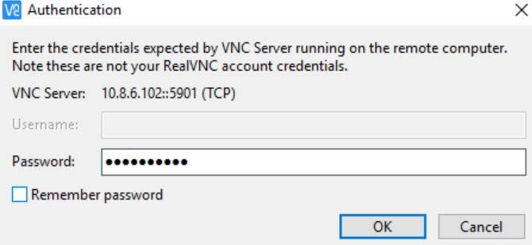

21. The first time you login to the VNC session, you will have to answer a series of questions. First, set the language. Click _Next_ after selecting _English_.

22. The next menu provides an opportunity to set the keyboard layout. Take the default option and continue by clicking _Next_.

23. The next menu asks if location services need to be on. For now, let’s set it at on and click _Next_.
    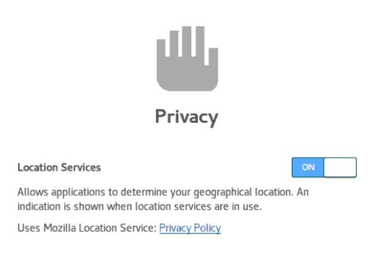

24. The next menu provides the ability to connect to existing online accounts. Click _Skip_.

25. You’re now ready to go. Click ‘Start Using Red Hat Enterprise Linux’.
    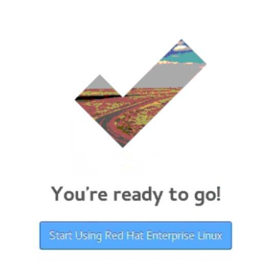

26. The next screen provides some Getting Started related tips.
    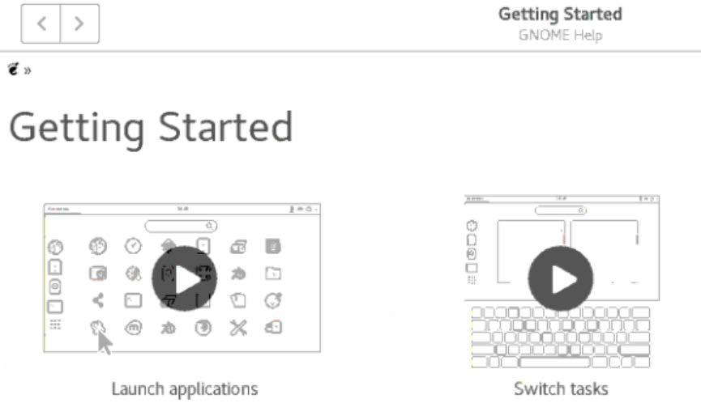

27. Click the Close button on the top-right corner to close the Getting Started menu.

28. Right click on the Desktop, go to Display Settings and select a resolution that looks good for your machine.
    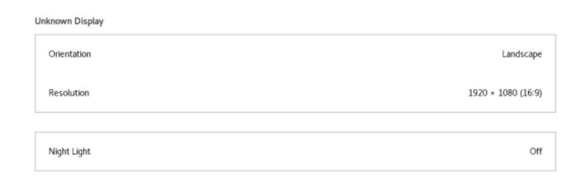

## Section 4. System management tools

> Note: The following questions navigate many of the graphical administrative tools available with Red Hat Enterprise Linux. Some questions are designed more as an introduction, and not an in-depth look at the specific operation. The goal of these questions is not to infer that the GUI tools are superior to CLI options.

29. From your VNC session, select the Activities tab at the top of the screen. What do you see?
    

30. To improve VNC picture quality, move your mouse next to the where date and time is displayed. VNC settings should pop up as shown below.
    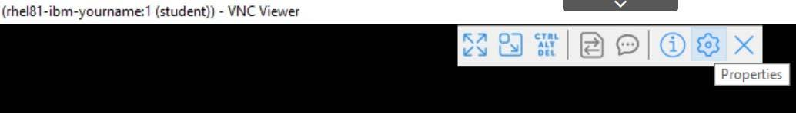

31. Click _Properties_. Select Picture quality as ‘High’.
    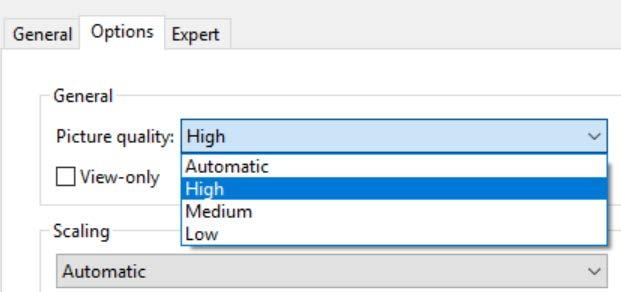

32. You may optionally scale the display using the other VNC options to determine the right fit for your environment.

33. Click _Activities_, followed by _Files_.
    

34. Click on **Other Locations**, then **Computer**. Look at the **root** folder. What do you see?
    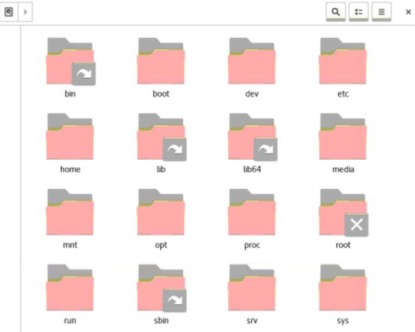

    - Remember that the VNC server is serviced by the user student, so access to the root folder contents would not be allowed due to permission settings. This is indicated by the X symbol.

35. Click Activities followed by Software. This is like an app store where you can find and fetch good software. Close this application.

36. Click Activities, then enter System Monitor on the search bar.
    

    - Open the System Monitor application.

37. View the System Monitor option. What does this show?

    - The first menu shows active Processes. You can also select the Resources or File Systems button to see additional information.
      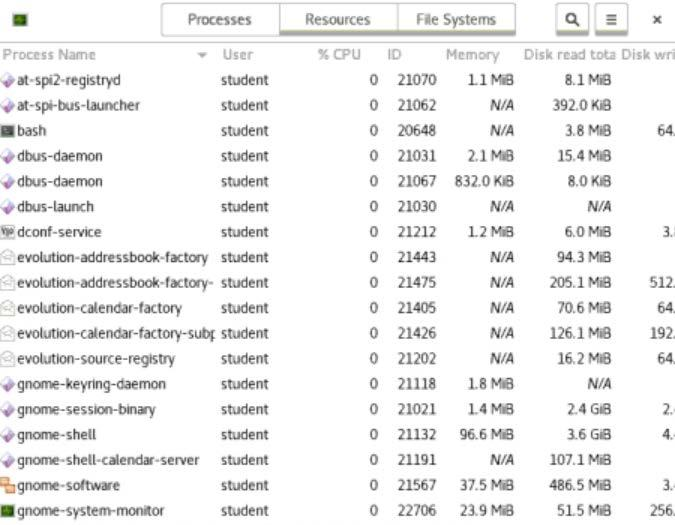

38. Close the System Monitor application. From the Activities tab, search for Disks. Open the Disks application. What devices are shown

    - As in the example below, you should see all disks known by the system. Notice the primary drive (sda), shows as a model IBM NVDISK. This is because the disk is backed by the VIO Server.
      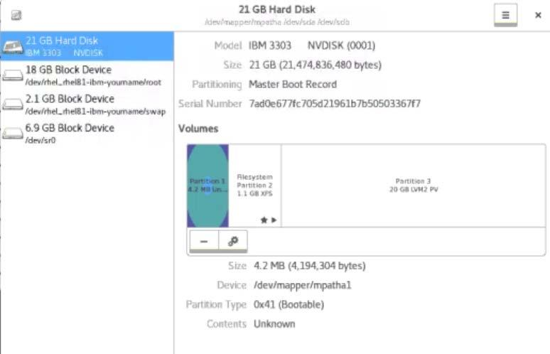

39. Close the Disks application. From Activities, click Terminal.
    - Find out the present working directory.
      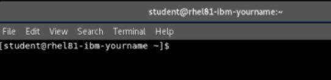

> **Question:**
> What is the present working directory? \***\*\_\_\_\_\*\***

40. Enter the `gnome-system-monitor` command from the terminal prompt. Does this look familiar?

    - Your screen should show the same window as the **system monitor** tool you accessed before. Navigate through the 3 sub-menus to see what information is available.
      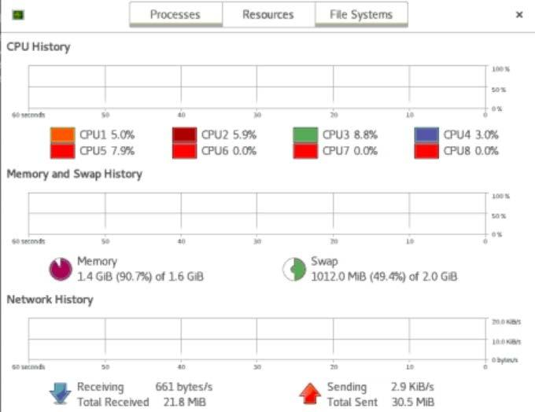

41. Close all open applications on your Windows VM.

42. Return to your learning platform and proceed with the course.

## End of exercise
